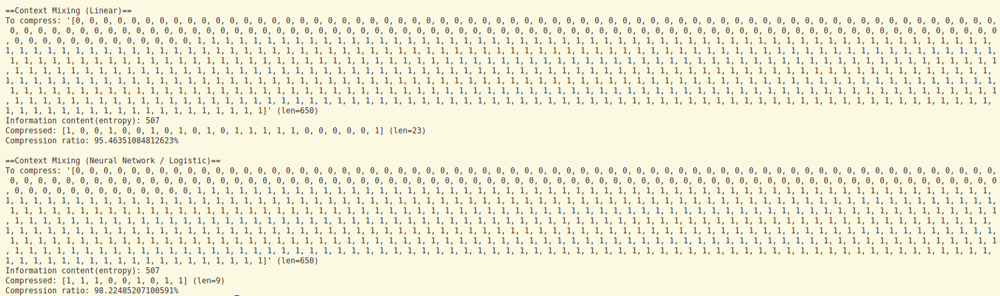
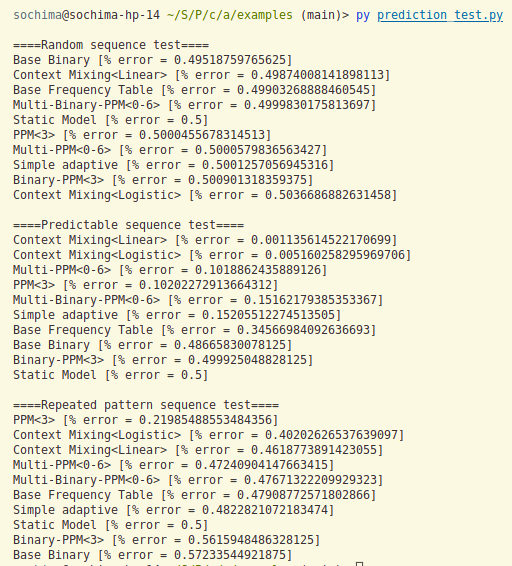

# Sample Usage

This folder contains a collection of sample scripts that demonstrate how to use the various features of the arithmetic_coding library. The examples are organized into different files based on the type of example or the model being demonstrated.

It also includes prediction tests which tests the efficiency of all the models in making predictions.

## Note

Please note that these examples are provided as a learning resource, not as production-ready code. The examples are not intended to be used in a production environment, and should be used only for learning and experimentation.

## How to run

First `cd` into this folder.

Then if you want to run the `context_mixing_models.py` sample, you would do:

```bash
python context_mixing_models.py
```

Sample output:



To run the prediction tests:

```bash
python prediction_test.py
```

Sample output:


